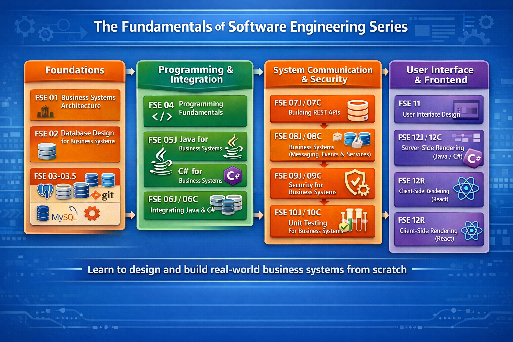
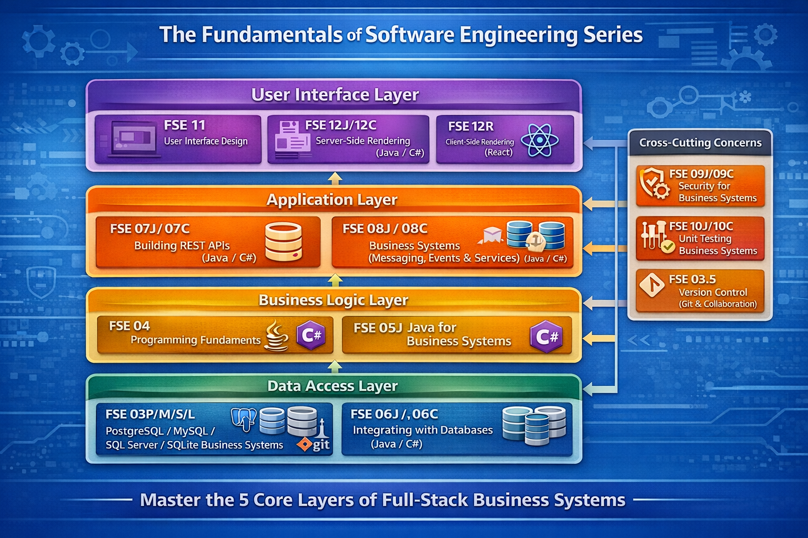

= Fundamentals of Software Engineering

== Courses in the Series
* FSE 01: Understanding Business Systems Architecture
* FSE 02: Database Design for Business Systems
* FSE 03P: Building PostgreSQL Databases for Business Systems
* FSE 03M: Building MySQL Databases for Business Systems
* FSE 03S: Building SQL Server Databases for Business Systems
* FSE 03L: Building SQLite Databases for Business Systems
* FSE 04: Version Control for Business Systems (Git & Collaboration)
* FSE 05: Programming Fundamentals for Business Systems
* FSE 06J: Java for Business Systems (OOP & Application Design)
* FSE 06C: C# for Business Systems (OOP & Application Design)
* FSE 07C: Integrating C# with Databases for Business Systems
* FSE 08J: Building REST APIs for Business Systems (Java)
* FSE 08C: Building REST APIs for Business Systems (C#)
* FSE 09J: Business Systems Integration (Messaging, Events & Services) (Java)
* FSE 09C: Integrating Business Systems (Messaging, Events & Services) (C#)
* FSE 10J: Security for Business Systems (Java)
* FSE 10C: Security for Business Systems (C#)
* FSE 11J: Unit Testing for Business Systems (Java)
* FSE 11C: Unit Testing for Business Systems (C#)
* FSE 12: User Interface Design for Business Systems
* FSE 13J: Server-Side Rendering for Business Systems (Java)
* FSE 13C: Server-Side Rendering for Business Systems (C#)
* FSE 13R: Client-Side Rendering for Business Systems (React)

== The Series

== The Layers

